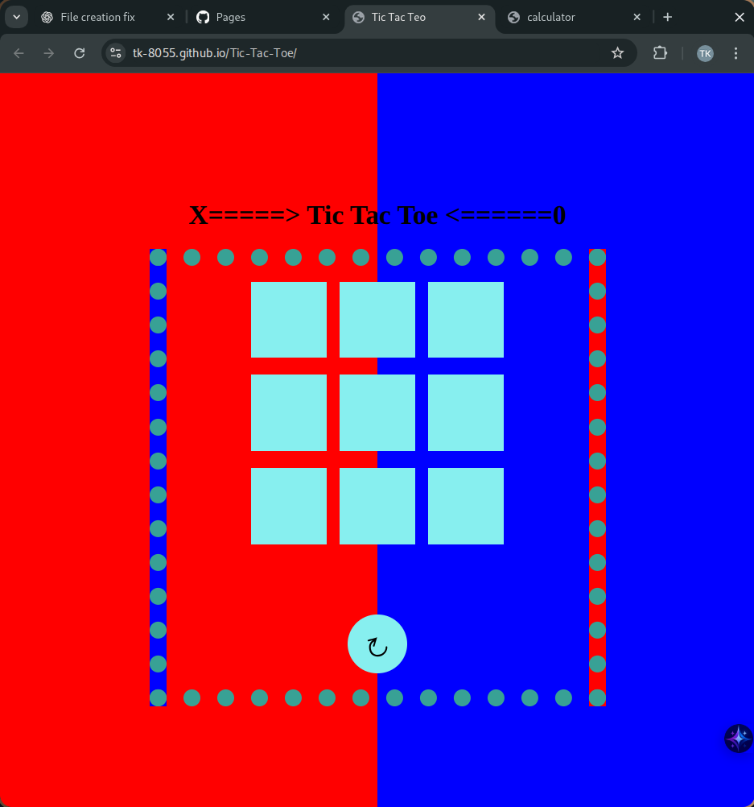
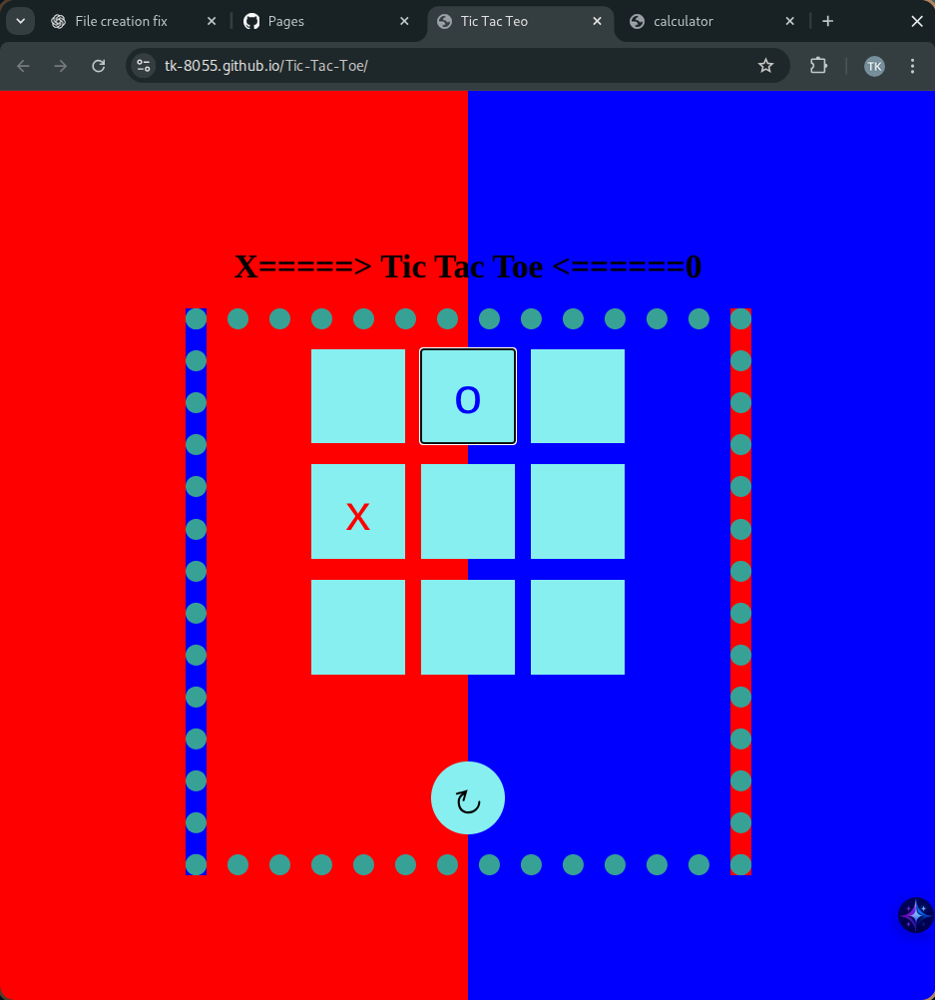

# Tic Tac Toe (X-O Game)

A simple, interactive Tic Tac Toe (X-O) game built with **HTML, CSS, and JavaScript**.

## 🎯 Features
- Two-player mode (local)
- Turn-based gameplay (X goes first)
- Automatic win/draw detection
- Clean and minimal design
- Restart button to play again

## 🛠️ How to Play
1. Open the game in your browser.
2. Click on an empty cell to place your mark ("X" starts first).
3. Alternate turns until a player wins or the game ends in a draw.
4. Click the ↻ Restart button to play again.

## 💻 Tech Stack
- HTML
- CSS
- JavaScript

## 🚀 Live Demo
https://tk-8055.github.io/Tic-Tac-Toe/

## 🎨 Screenshots

